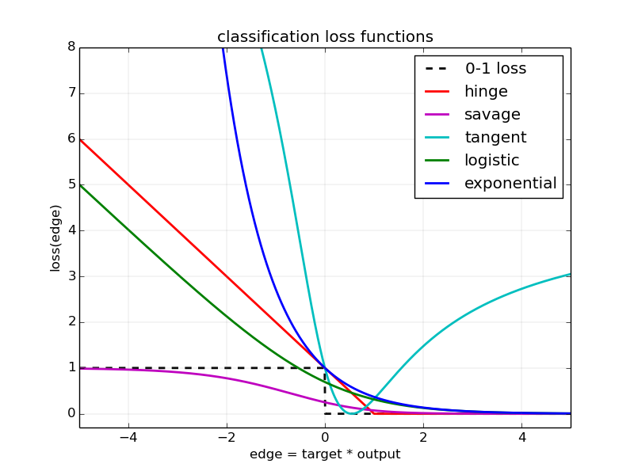
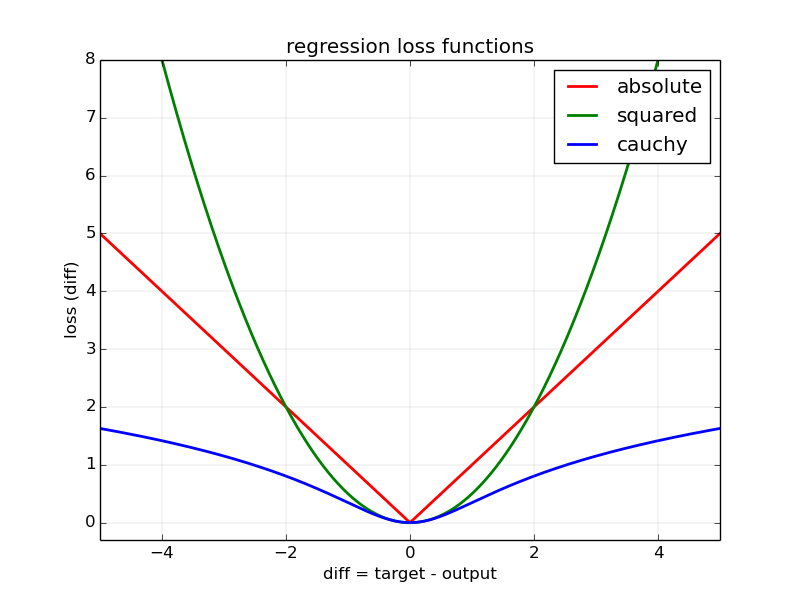

# Machine learning module


#### Introduction

Libnano implements several state of the art machine learning models. These models can be trained Both training and evaluation is supporte


The machine learning module has support for various supervised

A **dataset** is a collection of samples (e.g. images, measurements, time series) useful for training and testing machine learning models. The samples are organized in folds following the associated protocol of each dataset; each fold contains disjoint training, validation and testing sample subsets.

LibNano has built-in support for several flavors of well-known datasets. Use the following command to download and uncompress locally these datasets to ```${HOME}/libnano/datasets```:
```
bash scripts/download_datasets.sh --all
```

An example of how to load and access various builtin datasets is provided in ```app/info_dataset.cpp```.


TODO: introduce the loss concept


#### Dataset


##### Tabular datasets

A **tabular dataset** consists of fixed-size inputs and targets loaded from a comma-separated values (CSV) file. Each sample (or measurement) corresponds to a line in the CSV file and each column corresponds to either an input or a target feature. Furthermore the features can be of various flavors:
* optional (e.g. not given),
* discrete or categorical (e.g. the labels used in classification problems) or
* or continuous (e.g. the target used in regression problems).

The interface of interest for this type of datasets is tabular_dataset_t. The builting tabular datasets can be listed in C++ from the associated factory:
```
for (const auto& tabular_id : nano::tabular_dataset_t:all().ids())
{
    std::cout << "tabular_id: " << tabular_id << std::endl;
}
```

Another possibility is to run the command line utility app/info to print the ID and a short description of all builtin tabular datasets:
```
./app/info --tabular .+
|-----------------|---------------------------------------------------------------------------------------------------|
| tabular dataset | description                                                                                       |
|-----------------|---------------------------------------------------------------------------------------------------|
| abalone         | predict the age of abalone from physical measurements (Waugh, 1995)                               |
| adult           | predict if a person makes more than 50K per year (Kohavi & Becker, 1994)                          |
| bank-marketing  | predict if a client has subscribed a term deposit (Moro, Laureano & Cortez, 2011)                 |
| breast-cancer   | diagnostic breast cancer using measurements of cell nucleai (Street, Wolberg & Mangasarian, 1992) |
| forest-fires    | predict the burned area of the forest (Cortez & Morais, 2007)                                     |
| iris            | classify flowers from physical measurements of the sepal and petal (Fisher, 1936)                 |
| poker-hand      | predict the poker hand from 5 cards (Cattral, Oppacher & Deugo, 2002)                             |
| wine            | predict the wine type from its constituents (Aeberhard, Coomans & de Vel, 1992)                   |
|-----------------|---------------------------------------------------------------------------------------------------|
```


##### Image classification datasets

An **image classification dataset** consists of fixed-size RGB or grayscale images and their associated labels. The interface of interest for this type of datasets is imclass_dataset_t. The builting image classification datasets can be listed in C++ from the associated factory:
```
for (const auto& imclass_id : nano::imclass_dataset_t:all().ids())
{
    std::cout << "imclass_id: " << imclass_id << std::endl;
}
```

Another possibility is to run the command line utility app/info to print the ID and a short description of all builtin image classification datasets:
```
./app/info --imclass .+
|------------------------------|---------------------------------------------------------------------|
| image classification dataset | description                                                         |
|------------------------------|---------------------------------------------------------------------|
| cifar10                      | classify 3x32x32 color images (CIFAR-10)                            |
| cifar100c                    | classify 3x32x32 color images (CIFAR-100 with 20 coarse labels)     |
| cifar100f                    | classify 3x32x32 color images (CIFAR-100 with 100 fine labels)      |
| fashion-mnist                | classify 28x28 grayscale images of fashion articles (Fashion-MNIST) |
| mnist                        | classify 28x28 grayscale images of hand-written digits (MNIST)      |
|------------------------------|---------------------------------------------------------------------|
```


##### Synthetic datasets

A **synthetic dataset** is often used to test and benchmark machine learning algorithms. The difficulty of the task is easily controlled for example by changing the dimensionality of the input or by adding a variable amount of noise.

TODO: explain affine_synthetic_dataset_t.


#### Iterator


TODO: explain iterators, extend its interface to return feature_t objects for both inputs and targets

TODO: implement basic computer vision features for image classification datasets

TODO: implement basic features (e.g. log-scaling, normalization, histogram) for tabular datasets


#### Loss functions


TODO: explain error functions

TODO: explain loss functions

TODO: explain 4D tensor inputs

TODO: single-label and multi-label classification




TODO: multivariate regression





TODO: gnuplot scripts to plot the loss vs. errors


##### Models


TODO: explain linear model: regularization, normalization, benchmark etc.

TODO: explain gradient boosting models: general algorithm, weak learners etc.
